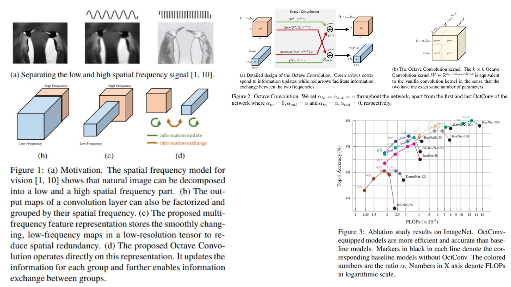

# 🧿 OctConv-Replication

This repository provides a **faithful PyTorch replication** of the **Octave Convolution (OctConv)** architecture, focusing on reducing **spatial redundancy in convolutional neural networks** by decomposing feature maps into **high- and low-frequency components**.It reconstructs the full pipeline from the original paper including **octave feature representation, cross-frequency convolution paths, and efficient information exchange between resolutions**.

Paper reference: *Drop an Octave: Reducing Spatial Redundancy in Convolutional Neural Networks with Octave Convolution*  https://arxiv.org/abs/1904.05049  

---

## Overview 🌌



> OctConv replaces standard convolution with a **frequency-aware factorization**, where feature maps are split into **high-frequency (detail-rich)** and **low-frequency (structure-rich)** components. This enables spatial redundancy reduction by processing low-frequency features at reduced resolution while maintaining information flow between branches.

Key ideas:

- **Octave Feature Representation**: splits feature maps into high-frequency and low-frequency groups  
- **Cross-Frequency Convolution Paths**: four-way interaction between feature groups  
- **Spatial Efficiency**: low-frequency maps are computed at $$\frac{H}{2} \times \frac{W}{2}$$ resolution  

---

## Core Math 📐

**Octave feature decomposition:**

$$
X = \{X^H, X^L\}
$$

$$
X^H \in \mathbb{R}^{(1-\alpha)c \times H \times W}, \quad
X^L \in \mathbb{R}^{\alpha c \times \frac{H}{2} \times \frac{W}{2}}
$$

**OctConv output formulation:**

$$
Y^H = f(X^H) + up(f(X^L))
$$

$$
Y^L = f(X^L) + f(pool(X^H))
$$

**Cross-frequency interaction:**

- H → H (high detail refinement)  
- H → L (downsampled context flow)  
- L → L (compressed structure processing)  
- L → H (upsampled detail injection)  

**Parameter equivalence:**

$$
W \in \mathbb{R}^{c_{in} \times c_{out} \times k \times k}
$$

---

## Why OctConv Matters ⚡

- Reduces **spatial redundancy in CNN feature maps**  
- Improves efficiency without changing backbone architecture  
- Provides consistent **FLOPs and memory reduction**  

---

## Repository Structure 🏗️

```bash
OctConv-Replication/
├── src/
│   ├── blocks/
│   │   ├── octave_conv.py
│   │   ├── pooling.py
│   │   └── upsample.py
│   │
│   ├── modules/
│   │   ├── octave_block.py
│   │   ├── octave_resblock.py
│   │   └── octave_transition.py
│   │
│   ├── model/
│   │   ├── oct_resnet.py
│   │   └── oct_classifier.py
│   │
│   └── config.py
│
├── images/
│   └── figmix.jpg
│
├── requirements.txt
└── README.md
```

---

## 🔗 Feedback

For questions or feedback, contact:  
[barkin.adiguzel@gmail.com](mailto:barkin.adiguzel@gmail.com)
